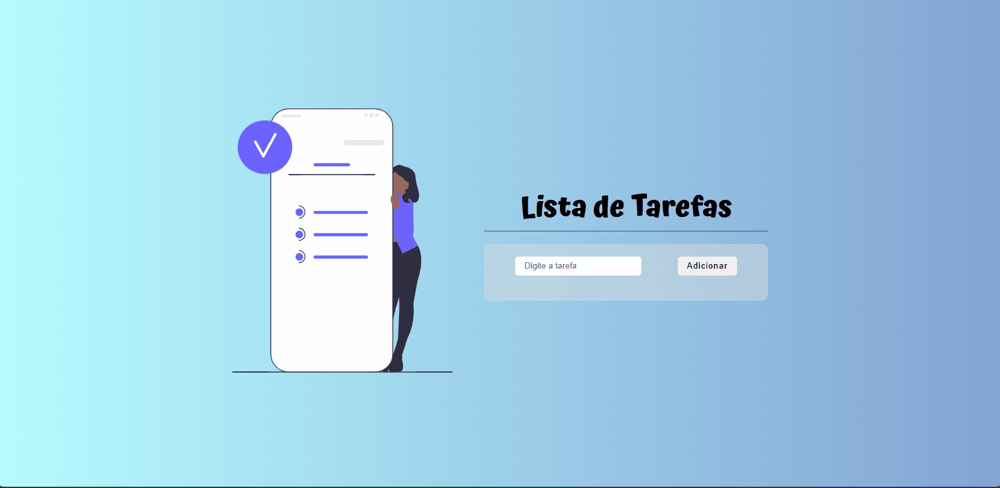

<h1 align="center">Check Taks</h1>
 

### 🚨 Sobre o Projeto

O Check Tasks é um projeto simples e funcional desenvolvido com HTML, CSS e JavaScript, ideal para ajudar os usuários a organizar e gerenciar suas tarefas do dia a dia. Com ele, é possível adicionar tarefas, marcá-las como concluídas ou excluí-las, tudo de forma prática e intuitiva. Um dos grandes diferenciais do projeto é a persistência de dados: mesmo ao reiniciar a página, as tarefas permanecem salvas, garantindo que nada seja perdido. O Check Tasks foi criado com foco na simplicidade e eficiência, sendo uma ferramenta leve e útil para quem busca aumentar a produtividade.

<strong>Link:<strong> https://joaonodari.github.io/checkTaks/

### 🔨 Ferramentas Utilizadas

* [HTML](https://developer.mozilla.org/pt-BR/docs/Web/HTML)
* [CSS](https://developer.mozilla.org/pt-BR/docs/Web/CSS)
* [JSS](https://developer.mozilla.org/pt-BR/docs/Web/JavaScript)

### 📽️ Projeto 

    </img>
    
Giff do Projeto

